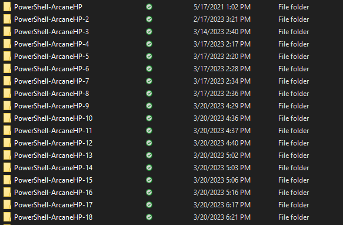

# (No) Fun With PowerShell - Disappearing Modules and OneDrive

## Introduction

I was having a weird problem with PowerShell, while working on my [ArcaneBooks](https://arcanecode.com/2023/03/13/the-arcanebooks-project-an-introduction/) project. I would install a module, and it would work fine at first. I could see the module when I used `Get-Module -ListAvailable`, and use it.

The problem occurred when I closed the terminal (whether the Windows Terminal or in VSCode), then reopened it. The module had vanished! It was no longer there, I would get an error if I tried to import it, and `Get-Module -ListAvailable` would no longer show it. I could reinstall, it'd be there, but again when I closed the terminal and reopened it would be gone.

I Binged and Googled and DuckDucked with no luck, so I put out a cry for help on Twitter. While waiting I went to a second computer. Both machines had Windows 10 Pro, and on the second machine I updated PowerShell so both were on 7.3.3 (current release as of this blog post). By golly, on the second machine everything worked correctly!

I could install a module, exit the terminal, return, and it would still be there. Confused even more now, I returned to Twitter.

A kindly user named Flavien Michaleczek | [@_Flavien](https://twitter.com/_Flavien) suggested I look into the pathing. So I checked the `$env:PSModulePath` on both computers.

The paths on both were identical, except for the first entry. On the working computer, the first entry was `C:\Users\arcan\Documents\PowerShell\Modules`. Pretty standard.

On the non-working computer, the path was set to `D:\OneDrive\Documents\PowerShell\Modules`. Apparently at some point I told Windows to store my Documents folder on OneDrive, which I'd stored on my D drive for space reasons.

I rolled up my sleeves and took a look in `D:\OneDrive\Documents` and what did I find?

Apparently every time I installed a module, PowerShell was creating a brand new PowerShell folder in my Documents drive, using PowerShell plus my computer name followed by a number. It would use that folder right up until I closed the terminal.

## Not The Fix, But Getting There

Can you guess what folder I **didn't** find in the Documents folder?

It was `D:\OneDrive\Documents\PowerShell`!

That's right dear reader, there was no folder in `Documents` named just `PowerShell`. So, I manually created it.

I now opened a new terminal and installed a module. Looking in the `D:\OneDrive\Documents\PowerShell` I could see it had created a `Modules` folder, and in it was the module I'd just installed.

I held my breath, closed the terminal, and reopened. Now when I did `Get-Module -ListAvailable` it showed up! And I could import it and use it. I deleted all the duplicate PowerShell-ArcaneHP-xx folders and returned to work, foolishly thinking I'd solved the problem.

## But It Didn't Quite Work

Things looked good until I came back the next day and tried again, to discover the PowerShell folder was gone!. I said some dirty words and went back to diagnosing things, comparing my working machine to the broken one.

I realized, in comparing the paths between the working and broken computers, that on the working computer my Documents folder was **NOT** in my OneDrive. Realizing OneDrive may be at issue I returned to scouring the web with a new set of search terms.

I found OneDrive has a habit of arbitrarily deleting files and folders. None of the entries I found online could explain why, or the logic it used. It wasn't necessarily the PowerShell folder, people had pictures, documents, and more disappear.

To be fair they didn't vanish entirely, they went into the OneDrive recycle bin, but if you didn't know to look there you might have lost some important data.

## The Fix

I found a fix, well to be precise it's not really a fix but a work around.

And you may not like it. Be sure to read through to the end of this post before trying it, as you need to understand the ramifications of what happens when you do this.

The trick is to tell OneDrive **not** to sync your Documents folder. There's just a few basic steps.

Right click on your OneDrive icon in the taskbar, and pick Settings.

Under **Sync and backup**, click the **Manage backup** button.

Click on the toggle button beside **Documents**, to turn it off. It will prompt you to make sure you know what you are doing, just confirm you no longer want to sync Documents.

Click on **Save Changes** at the bottom. Then close the OneDrive Settings dialog by clicking the X in the upper right corner.

## Ramifications

At this point you now have not one but two documents folders. You've probably noticed when you open File Explorer, you see an entry for "Documents".

This is what Microsoft calls a _Symbolic Link_. It's nothing more than a built in shortcut.

Before the change, when you let OneDrive handle your Documents folder the symbolic link pointed to C:\Users\\[your_user_name_here]\OneDrive\Documents.

After you remove Documents from under the control of OneDrive, this symbolic link now redirects to C:\Users\\[your_user_name_here]\Documents. This is now your default "Documents" folder, often called your _local_ Documents folder. Windows will want to default to saving to your local Documents folder when you try to save a file using many apps, such as Office. If you want these saved in OneDrive all you have to do is tell the application to save to one of your OneDrive folders.

Your previous Documents folder from OneDrive should still be there, it would be located at **C:\Users\\[your_user_name_here]\OneDrive\Documents**. Making the change to remove Documents from the control of OneDrive **does not move any of the files or folders you previously had in OneDrive to the new local Documents folder**.

As I want to be clear, I need to state something in big bold clear text.

> After making the change, your (local) Documents folder will no longer be backed up automatically. **You will be responsible for backing up your Documents folder manually!**

Of course the easy answer to the above issue is to just save somewhere on your OneDrive, but I felt I needed to state this clearly.

For me, making the change to no longer let OneDrive manage Documents wasn't a big deal as I rarely used the default Documents folder anyway. Instead I have folders in OneDrive setup for the different items I work on, such as PowerShell scripts, Pluralsight courses, blog posts, and the like.

If you were a heavy user of Documents though, you'll have to retrain yourself to save to an appropriate spot in OneDrive.

## Cleanup

As a last step, open File Explorer, go to your local Documents folder (the one at C:\Users\\[your_user_name_here]\Documents). It should be empty, although it may have a link to the OneDrive Documents folder.

In the local, empty Documents folder create a PowerShell folder, from here you should be good to go.

## Conclusion

If you suffer from disappearing module syndrome, check to see if your Documents folder is being stored in OneDrive. If so, _carefully_ consider following the instructions in this post to remove Documents from the control of OneDrive, understanding you'll now be responsible for backing up anything stored there.

This issue consumed far too much of my time this week, so next week I'll be picking back up on the ArcaneBooks series. In my [previous post](https://arcanecode.com/2023/03/20/arcanebooks-isbn-overview-powershell-and-the-simple-openlibrary-isbn-api/) I talked about the "basic" web API for getting book data from OpenLibrary using the ISBN. In my next post I'll continue the discussion on extracting ISBN book numbers using their "advanced" API.

If you like PowerShell, you might enjoy some of my Pluralsight courses. [PowerShell 7 Quick Start for Developers on Linux, macOS and Windows](https://pluralsight.pxf.io/jWzbre) is one of many PowerShell courses I have on Pluralsight. All of my courses are linked on my [About Me](https://arcanecode.com/info/) page.

If you don't have a Pluralsight subscription, just go to [my list of courses on Pluralsight](https://pluralsight.pxf.io/kjz6jn) . At the top is a Try For Free button you can use to get a free 10 day subscription to Pluralsight, with which you can watch my courses, or any other course on the site.

Blog Link: [(No) Fun With PowerShell - Disappearing Modules and OneDrive](https://arcanecode.com/2023/03/27/no-fun-with-powershell-disappearing-modules-and-onedrive/)