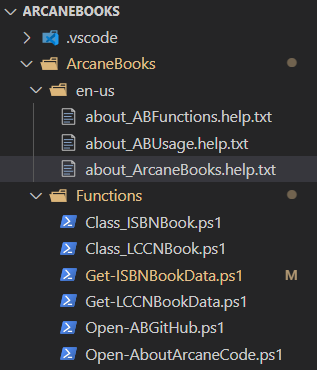

# Fun With PowerShell - Authoring About Help

## Introduction

In my previous post, [Fun With PowerShell - Authoring Help](https://arcanecode.com/2023/05/02/fun-with-powershell-authoring-help/), I covered how to author comment based help for your functions.

In addition to help for your functions, it's also possible to write `about_` help. PowerShell itself contains many [about topics](https://learn.microsoft.com/en-us/powershell/module/microsoft.powershell.core/about/about?view=powershell-7.4) for PowerShell itself.

These about topics are designed to provide further information for your users, information that may not fit into the confines of a functions help. These texts can be as long as you need.

## The Contents of an About Topic File

An about file can contain literally any text you want. Whatever is in there will be returned when you use `Get-Help` to retrieve its contents.

However, there is a suggested guideline for the formatting of an about file.

```

about_TopicName

SHORT DESCRIPTION
   Brief description, one to two sentences.

LONG DESCRIPTION
   Much longer text, could be several paragraphs.

BACKGROUND
   This isn't a standard option but one I like to include to provide context
   to the reader about why the module was created. What problem was it meant
   to solve.

NOTE
   Miscellaneous notes about the module, such as the copyright

TROUBLESHOOTING NOTE
   Warning notes of issues you may find, perhaps a to-do list

SEE ALSO
  links to relevant things, such as the project github site
  or the authors website

ABOUT TOPICS
   List other about topics

KEYWORDS
   Keywords here

```

I usually leave one blank line at the top, to separate the text from the `Get-Help` command, but this is just my personal preference.

It is then customary to put the name of the about topic, as shown.

The next two are self explanatory, a short and long description for the topic. While not required by PowerShell code, it is highly suggested as PowerShell can use the text in the SHORT DESCRIPTION with `Get-Help`, but we'll talk about that later in the post.

Next up is a section I call BACKGROUND. I usually include this in the about topic for a module, to explain what problem this module was meant to solve, how it came to be, and so on. If I have any other about topics I generally omit this unless it is appropriate to the topic. To be clear, this is something I do, not a standard.

The note section is just what it says, it is for any notes that haven't been covered in the other sections. I generally use this to place the copyright notice, the author name and contact info, and similar data.

The TROUBLESHOOTING NOTE area is used to let the user know of any issues they may encounter. One common one I find is that about topics don't display correctly in some (but not all) version of Linux.

You might also include information about functions that will have further development done, or perhaps a note that documentation is still being worked on. This type of information can be especially useful for a module that is still in the alpha or beta stages, where further work will still be done.

Under the SEE ALSO section you can provide links to a projects github site, the PSGallery page, the author website, or other relevant links.

In the about topic page for the module, I like to provide a full list of all the about topics provided in the module, so the reader will know what else is available. Again, I usually only include this in the about page for the module itself and omit from other about topics unless it is relevant. We'll touch on the about topic for a module momentarily.

The final section allows you to place keywords for a module or about topic. These can be useful when searching for a module that covers the included keywords.

## Placement of About Topics

Under the modules main folder, you should create a folder with the standard language abbreviation for your target language. For example, for US English the folder would be named `en-us`. If I were to also write documentation for the French language (which would be a real feat as I don't know any French) I would create a folder named `fr-FR`.

Here is the layout for my ArcaneBooks module.



At the top is the folder `ArcaneBooks`, which is the root folder for the module. Under it is a folder, `en-us` where English language help files are placed. Here I only have `about` topics, but if I were using XML based help those files would also be placed here.

Let's talk now about how to name your about files.

## Naming Your About Topic Files

The names of all about files should begin with `about_`. They should end with `.help.txt`. To create an about topic for the module itself (which you should at the very least include one about for the module) use the module name as I did here, with `about_ArcaneBooks.help.txt`.

If you then call help for the module, `Get-Help ArcaneBooks`, it will display the contents of the about file with the module name, `about_ArcaneBooks.help.txt`.

I've included two other about topics for the ArcaneBooks module. The first, about_ABFunctions, displays a list of functions in the module, with the synopsis of its purpose. I've found this to be of aid to the end user to help them see what functions are in the module. They can see this information using `Get-Help about_ABFunctions`.

The final about topic has examples of how to use the module. I usually develop a PS1 script to test out a module as it is being developed. I find this makes for great examples of how to use the module overall, and include a copy inside an about topic so an end user can use it as well.
As with the functions, a user can see this using `Get-Help about_ABUsage`.

## Getting Help

This is an example of calling help for the module.

```
PS D:\OneDrive\PSCore\ArcaneBooks\ArcaneBooks> Get-Help about_ArcaneBooks

about_ArcaneBooks

SHORT DESCRIPTION
   Retrieves book metadata based on the ISBN or LCCN.

LONG DESCRIPTION
   This module is designed to retrieve metadata for books based on either the
   ISBN or the LCCN (Library of Congress Catalog Number). It will return data
   such as the book title, author, and more.

   To see a list of functions, please use "Get-Help about_ABFunctions".

   In addition each cmdlet has help, you can use the Get-Help feature of
   PowerShell to learn more about each one.

BACKGROUND
   The author (Robert Cain aka ArcaneCode) is a member of the Alabama
   Historical Radio Society(https://alhrs.org/). They are beginning a project
   to create metadata for their library (title, author, publisher, etc.) and
   store it in cloud based software.

   Naturally we want to automate as much of this as possible, since the
   collection is rather extensive. Some of our books are so old they have
   neither an ISBN or a Library of Congress Catalog Number (LCCN for short).
   Those will require manual intervention to key in the data.

   Fortunately many of the books have the LCCN, the newer books have an ISBN,
   and a very few have both.

   The goal with this project was to allow a user to create a simple text file
   using notepad, Excel, or something similar. The user can enter an LCCN into
   one file or the ISBN in another.

   That data file will be piped through the appropriate cmdlets found in this
   module and produce a list of metadata for each book including things such
   as the book title, author, publication date, and the like.

   This output can then be piped into standard PowerShell cmdlets to output
   the data to formats such as CSV, XML, JSON, and the like.

   The sources used in this module are the Library of Congress or the
   Open Library site, which is part of the Internet Archive. Both provide
   web APIs that can use to retrieve data.

   For more information, please see the online documentation at the projects
   GitHub site, https://github.com/arcanecode/ArcaneBooks .

NOTE
   Author: Robert C Cain | @ArcaneCode | arcane@arcanetc.com

   This code is Copyright (c) 2023 Robert C Cain All rights reserved

   The code herein is for demonstration purposes. No warranty or guarantee
   is implied or expressly granted.

   This module may not be reproduced in whole or in part without the express
   written consent of the author.

TROUBLESHOOTING NOTE
   Help for the about_* topics doesn't work correctly on all versions of
   Linux due to issues with PowerShell's Help system.

SEE ALSO
     https://github.com/arcanecode/ArcaneBooks
     https://arcanecode.com/info/

ABOUT TOPICS
   about_ArcaneBooks
   about_ABFunctions
   about_ABUsage

KEYWORDS
     ArcaneBooks, ISBN, LCCN

```

## Getting A List of About Topics

Using `Get-Help`, you can get a list of all the about topics for modules loaded into memory.

``` powershell
Get-Help about_*
```

Here is a partial output of the result of the command.

```
Name                              Category  Module                    Synopsis
----                              --------  ------                    --------
about_ABFunctions                 HelpFile                            This is a listing of the functions available in the ArcaneBooks module.
about_ABUsage                     HelpFile                            Provides examples on how to call the functions with example data.
about_ArcaneBooks                 HelpFile                            Retrieves book metadata based on the ISBN or LCCN.
about_Aliases                     HelpFile
about_Alias_Provider              HelpFile
```

In order to get the synopsis to show up in the output, you must include a `SHORT DESCRIPTION`. Then the synopsis must appear on the line immediately after it. There cannot be a blank line between, if there is `Get-Help` won't display the synopsis.

## Conclusion

As you can see, creating about topic help is very simple. Just create a folder to store it, then create the text file (or files) you need. Name them appropriately, and PowerShell then takes care of the rest!
